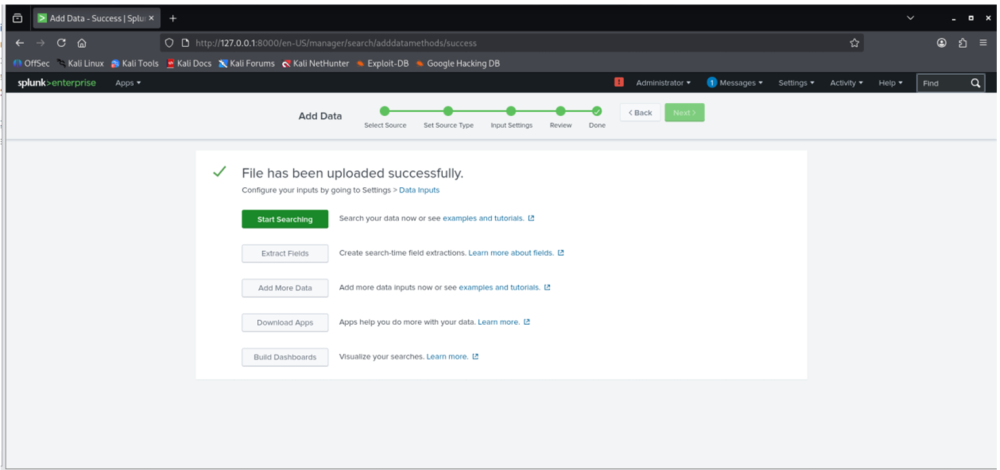
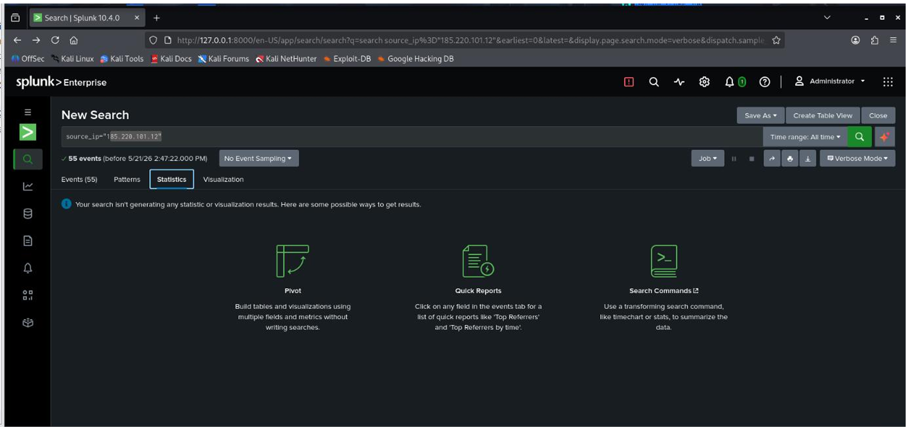
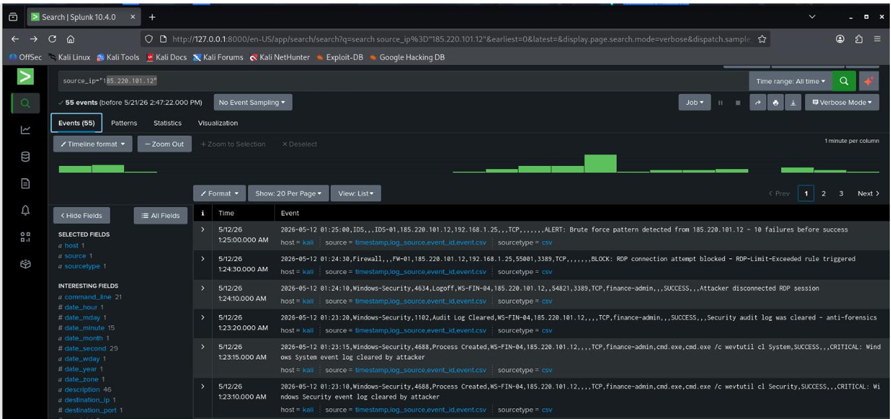
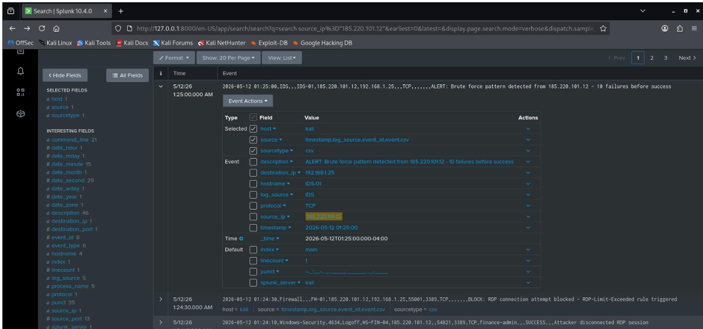

# Splunk Brute-Force Investigation

## Objective

Ingest Windows security-event data into Splunk, investigate repeated authentication failures, map the activity to MITRE ATT&CK, determine whether the attack progressed beyond failed attempts, and recommend response actions.

## 1. Data Ingestion

The supplied CSV was uploaded into Splunk Cloud and indexed for investigation.

## 2. Initial Investigation

I began with failed-logon activity using Event ID **4625**. My first attempt used `src_ip`, but reviewing the available fields showed that the dataset used `source_ip`. This was an important investigation pivot: rather than assuming the query was correct, I validated the underlying data structure.

A Statistics-tab attempt also failed to generate the expected visualization.

I then pivoted manually to the suspicious source `185.220.101.12` and reviewed all associated activity.

Additional field-level review helped validate the event context.

## 3. Evidence Identified

The investigation identified:

- **Event ID 4634** — account logoff activity associated with the suspicious source;
- **Event ID 4688** — new process creation on the target system; and
- repeated failed authentication activity preceding the observed post-authentication events.

In my assignment, I treated the logoff and process-creation evidence as support that the brute-force activity had progressed to account compromise, while also noting a logging gap because the expected Event ID 4624 was not present in the supplied CSV.

## 4. MITRE ATT&CK Mapping

- **T1110 — Brute Force**: repeated login attempts.
- **T1078 — Valid Accounts**: mapped to the subsequent authenticated-account activity described in the investigation.

## 5. Response Recommendations

The response plan documented in the exercise included password reset, session termination, blocking the suspicious source, MFA for privileged accounts, deeper review of Event ID 4688 process details, host investigation, and escalation for full incident response.

Longer-term hardening included account-lockout controls, centralized Windows logging, and a Splunk alert for repeated failed authentication attempts.

## What This Lab Demonstrates

- Splunk data ingestion and search
- Windows authentication-event investigation
- Query troubleshooting and investigative pivoting
- MITRE ATT&CK mapping
- Incident assessment and escalation
- Remediation and detection recommendations
