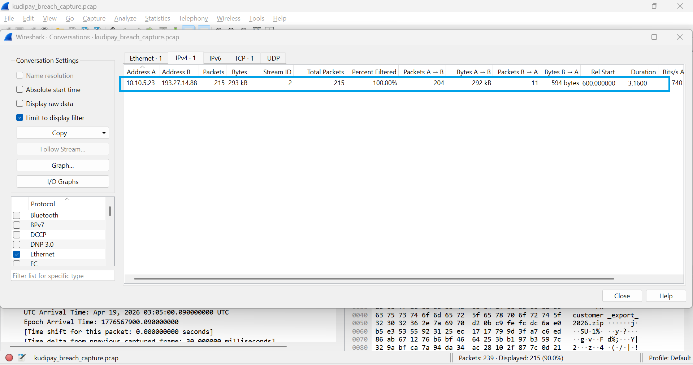
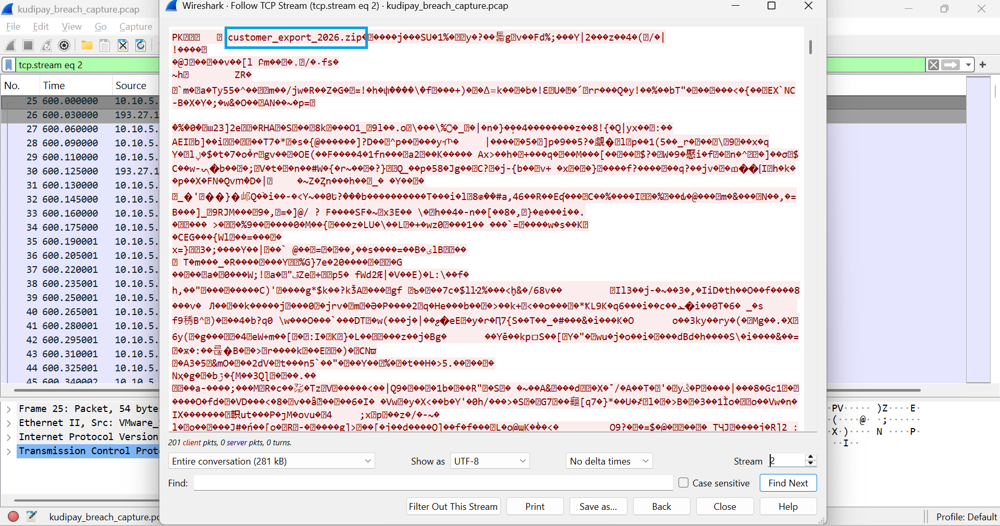

# KudiPay Network Investigation — Suspected Data Exfiltration

> Controlled mentorship scenario using fictional lab data.

## Objective

Analyze the supplied PCAP and identify suspicious network activity that could explain the reported breach.

## 1. Conversation Analysis

Wireshark Conversations showed communication between internal host `10.10.5.23` and external IP `193.27.14.88` over TCP port 443.

## 2. TCP Stream Analysis

During analysis of TCP Stream 2, the filename `customer_export_2026.zip` appeared within the communication stream.

The filename was followed by a large volume of encrypted SSL/TLS traffic from the internal host to the external destination. In the exercise, this pattern was assessed as evidence of **possible data exfiltration** and a reason to continue the investigation using host and cloud logs.

## CIA Triad Assessment

**Confidentiality:** affected if the suspected customer-data transfer was unauthorized.  
**Integrity:** potentially at risk because unauthorized access sufficient to create/export data could also enable modification, although the PCAP itself did not provide direct evidence of alteration.

## Conclusion

The packet capture established suspicious outbound encrypted communication and exposed an archive filename consistent with customer-data staging. The network evidence alone supported escalation and further host-level investigation rather than being treated as the sole source of confirmation.

## What This Lab Demonstrates

- Wireshark conversation analysis
- TCP-stream inspection
- Identification of suspicious outbound traffic
- Evidence-based exfiltration hypothesis
- CIA-triad impact assessment
- Escalation from network evidence to host investigation
