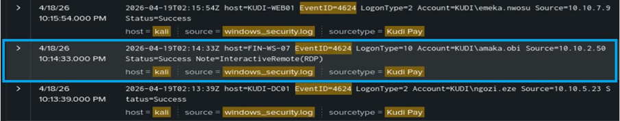
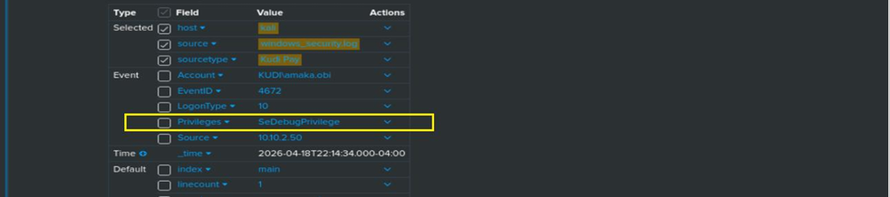
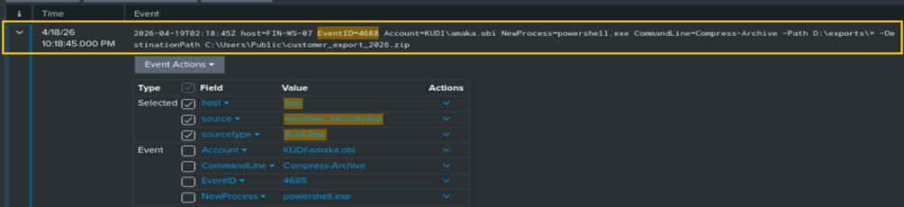
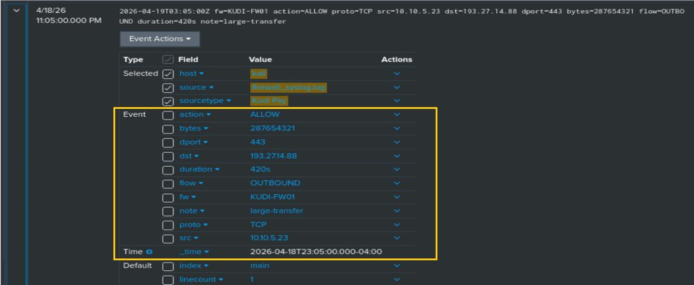
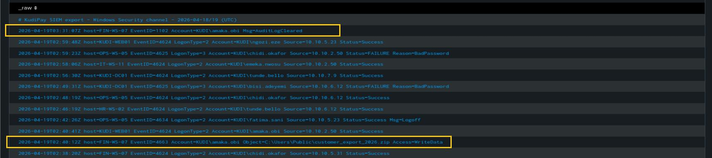

# SOC Incident Triage — Unauthorized Access & Data Exfiltration

> Controlled mentorship scenario using fictional lab data.

**Alert:** Suspected Unauthorized Access and Data Exfiltration  
**Severity:** High  
**Disposition:** True Positive  
**Status:** Escalated to L2 / Incident Response

## Investigation Summary

The triage exercise correlated Windows Security events and network evidence to assess a potential attack chain involving unauthorized access, elevated privileges, suspicious process execution, data collection, outbound transfer, and anti-forensic activity.

## 1. Successful Remote Login — Event ID 4624

The investigation began with successful authentication activity associated with the monitored system. The login characteristics were considered suspicious in the context of the wider incident.

## 2. Special Privileges — Event ID 4672

Event ID 4672 showed special administrative privileges being assigned, increasing concern that the session had elevated access.

## 3. Process Execution and Archive Activity — Event ID 4688

Process-creation evidence showed suspicious execution and archive/compression activity. This supported the hypothesis that data was being collected and staged for transfer.

## 4. Large Outbound Transfer

Firewall/network evidence showed a large outbound transfer during the same timeframe as the suspicious host activity.

## 5. Audit Log Clearing — Event ID 1102

Event ID 1102 showed that the Windows Security audit log was cleared. In the context of the preceding activity, this was treated as anti-forensic behavior requiring escalation.

## Triage Decision

The combined evidence was assessed as a **True Positive**. The incident was escalated to **L2 SOC / Incident Response** for deeper investigation.

## Recommended Actions

- Isolate the affected host where policy permits.
- Investigate the affected account and authentication sources.
- Review additional endpoint and network telemetry.
- Determine the scope of potential data exposure.
- Preserve logs and evidence for further analysis.

## What This Lab Demonstrates

- SOC alert validation and triage
- Windows Event ID analysis
- Correlation of authentication, privilege, process and network activity
- True-positive disposition
- Evidence preservation and escalation decisions
