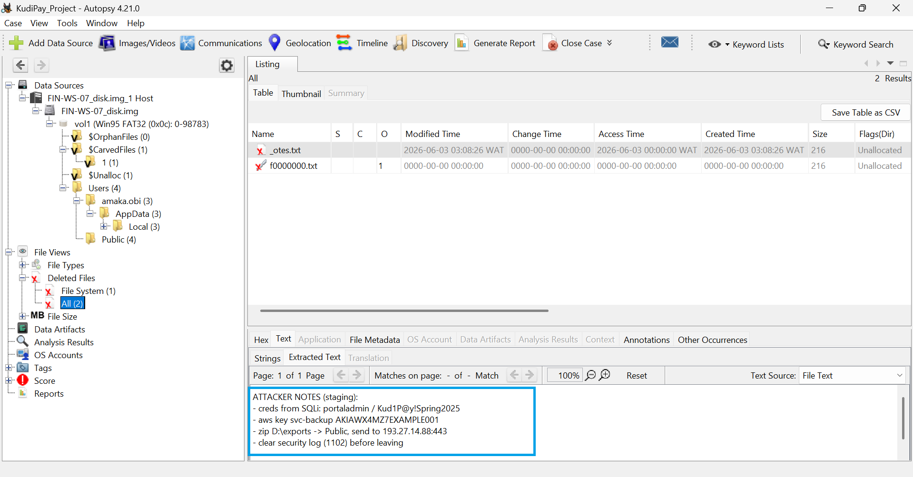
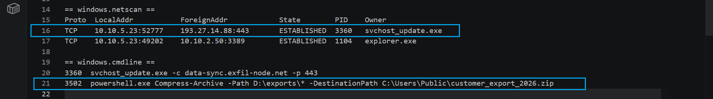
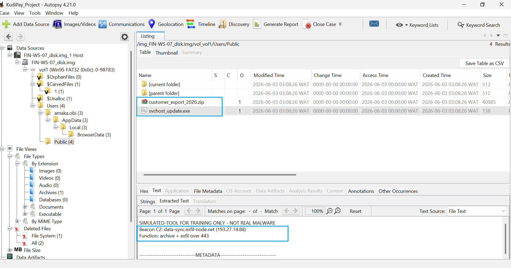
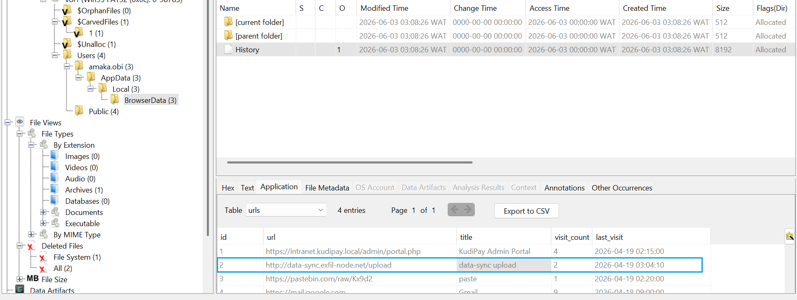
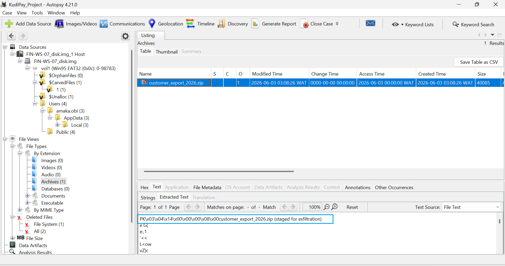

# Digital Forensics Investigation — Disk & Memory Evidence

> Controlled mentorship scenario using fictional lab data.

**Case ID:** KUDIPAY-DFIR-01  
**Evidence:** `FIN-WS-07_disk.img` and supplied memory-analysis output  
**Tools:** Autopsy and memory-analysis results

## Objective

Examine disk and memory artefacts to determine whether sensitive data was collected, staged, or exfiltrated from the finance workstation.

## 1. Recovered Deleted Attacker Notes

A deleted text artefact was recovered through Autopsy. The notes described credential access, archive staging, an external destination, and planned log clearing.

This became a lead for validating whether the described actions appeared elsewhere in the evidence.

## 2. Archive Creation

Memory-analysis output contained a PowerShell `Compress-Archive` command targeting the exports directory and creating `customer_export_2026.zip` in the Public user directory.

This supported the conclusion that files had been collected and staged in an archive.

## 3. Suspicious Executable

Autopsy examination identified `svchost_update.exe`. Its contents referenced an external beacon/C2 destination and archive/exfiltration behavior over port 443.

## 4. Supporting Browser Evidence

Browser-history artefacts referenced an upload endpoint associated with the external destination.

## 5. Archive Artefact

The archive `customer_export_2026.zip` was also identified in the forensic evidence.

## Conclusion

The disk and memory evidence supported a sequence of data collection, compression/staging, and external communication. The strongest aspect of the investigation was the consistency between independent artefacts: the recovered notes, archive command, suspicious executable, browser history, archive file, and memory/network activity.

## What This Lab Demonstrates

- Disk-image investigation with Autopsy
- Deleted-file recovery
- Memory artefact interpretation
- PowerShell command analysis
- Cross-source evidence correlation
- Forensic reasoning and reporting
- Chain-of-custody awareness
