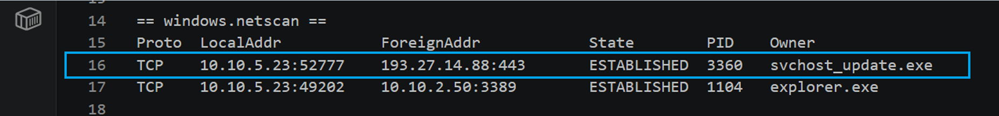
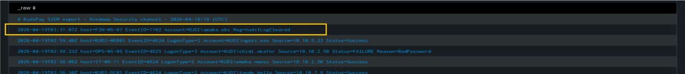

# Incident Response Capstone — Multi-Source Breach Reconstruction

> Controlled mentorship scenario using fictional lab data.

## Objective

Correlate the results of the network investigation, SOC triage, and digital-forensics investigation to reconstruct the incident and communicate the overall breach narrative.

## Evidence Correlation

### Phase 1 — Unauthorized Access and Elevated Privileges

SOC evidence showed suspicious authentication activity followed by Event ID 4672, indicating special privileges assigned to the session.


### Phase 2 — Data Collection and Staging

Forensic evidence recovered a PowerShell command creating `customer_export_2026.zip` from files in the exports directory.


Recovered notes also described the intended staging, transfer, and cleanup sequence.


### Phase 3 — Suspected Data Exfiltration

Network analysis identified the customer-export archive name inside the TCP stream associated with communication to an external destination.


### Phase 4 — Forensic Corroboration

Host/memory evidence showed an active connection to the same external IP observed in the network investigation.



### Phase 5 — Anti-Forensic Activity

Event ID 1102 documented clearing of the Security audit log after the suspicious activity.



## Reconstructed Attack Sequence

```text
Suspicious / Unauthorized Access
        ↓
Special Privileges Assigned
        ↓
Data Collection & Archive Creation
        ↓
Outbound Communication / Suspected Exfiltration
        ↓
Forensic Corroboration
        ↓
Audit Log Clearing
```

## Incident Assessment

The capstone report assessed the combined evidence as a confirmed security breach. That conclusion was based on correlation across the three investigation streams rather than any single artefact in isolation.

## Response Priorities

The report emphasized containment of the affected system/account, preservation of evidence, investigation of scope, review of exposed data, remediation of the access path, and strengthening of monitoring and preventive controls.

## What This Capstone Demonstrates

- End-to-end incident reconstruction
- Correlation of network, Windows log, disk and memory evidence
- Attack timeline development
- Technical-to-executive incident reporting
- Evidence-backed incident classification
- Remediation prioritization
